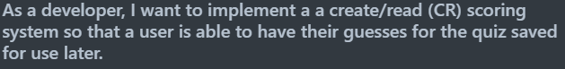
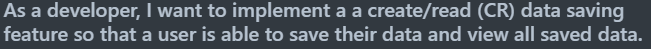
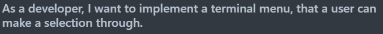

<h1 style="text-align:center">T1A3 - Python Terminal Application - Quiz</h1>

<h2 style="text-align:center"> Table of Contents </h2>

- [Purpose](#purpose)
- [Code Styling Guide](#codeGuide)
- [Features](#Features)
- [Implementation Plan](#plan)
- [Installation](#Installation)


- [Links](#Links)
- [References](#References)
- [License](#License)
- [Badges](#Badges)

## <h2 style="text-align:center" id="purpose">Purpose</h2>

As a developer I need to show that I am able to design, implement and test a terminal application and demonstrate that I am able to use a range of developer tools so that I can prove my learning and understanding of the python and it's implementation.

Application Mandatory Requirements:

- Accept user input either in the form of a file or text input
- Produce printed output or ability to interact with the file system

## <h2 style="text-align:center" id="codeGuide">Code Styling Guide</h2>
My terminal application adheres to the PEP 8 Code Styling Guide which contributes to it's readability, maintainability and it's functionality.

<b>Here are 10 ways my project adheres to the PEP 8 Code Styling Guide:</b>

1. Indentation: 
    - Ise of 4 spaces for indentation
2. Whitespace: 
    - Appropriate whitespace use around operators and after commas.
3. Naming Conventions: 
    - Follow naming conventions for Variable/Function names.
4. Line Length: 
    - Maximum Line length of 79 characters or less.
5. Comments: 
    - The code includes comments to explain the purpose of functions, their parameters, and return values
6. Function Documentation: 
    - Docstrings used to document functions, purpose, parameters, and return values inline with PEP 257
7. Imports Formatting: 
    - Each import statement on own line, lineImports are grouped and organized at the top of the file.
8. String Formatting: 
    - E.g. f-strings or .format() is consistent.
9. Error Handling: 
    - Graceful error handling for exceptions e.g. KeyboardInterrupt.
10. Module Organization: 
    - Promoting modularity and maintainability by having code organized into different functionalities within separate modules.

## <h2 style="text-align:center" id="features">Features</h2>

<h3 style="text-align:center">Feature 1: Main Menu</h3>
<h4 style="text-align:center">Description</h4>


<h4 style="text-align:center">Code Snippet - Menu Selection</h4>

```python
def menu_choice():
    """
    Feature 
    ----------
    Handles the main menu logic tree.

    Parameters
    ----------
    None
        
    Returns
    ----------
    None
    """
    try:
        while True:
            choice = IntPrompt.ask("[green] Please input your choice ")
            if choice == 1:
                choice_one()
            elif choice == 2:
                choice_two()
            elif choice == 3:
                clear_screen()
                print("You have chosen to exit the game!")
                exit()
            else:
                clear_screen()
                quiz_header()
                quiz_table()
                console.print(":cross_mark:","[red] INVALID OPTION",":cross_mark:","\n:cross_mark:","[red] PLEASE TRY AGAIN",":cross_mark:" ,style="bold")        
    except KeyboardInterrupt:
            try:
                clear_screen()
                exit()
            except SystemExit:
                clear_screen()
                exit()
```
<br>
<br>
<h3 style="text-align:center">Feature 2: Scoring System</h3>
<h4 style="text-align:center">Description</h4>


<h4 style="text-align:center">Code Snippet - Scoring System</h4>

```python
def save_highscores(self):
        with open ('highscores.csv', 'a',newline='') as f:
            write = csv.writer(f, quoting=csv.QUOTE_NONNUMERIC)
            write.writerow([self.first_name, self.last_name, self.score])
        """
        FEATURE
        ----------
        This method saves the users data to the highscores.csv

        Parameters
        ----------
        None
        
        Returns
        ----------
        None
        """ 
```
<br>
<br>

<h3 style="text-align:center">Feature 3: User Input</h3>
<h4 style="text-align:center">Description</h4>


<h4 style="text-align:center">Code Snippet - User Input</h4>

```python
def get_user_input():
    """
    Function will retrieve the user input.
    Parameters
    ----------
    None
        
    Returns
    ----------
    UserInput
        This will be the int value that corresponds with the users guess.
    """
    try:
        return IntPrompt.ask("[green] Please enter the corresponding number: ")
    except KeyboardInterrupt:
        exit()
    except Exception:
        console.print(":cross_mark:","[red] INVALID OPTION",":cross_mark:","\n:cross_mark:","[red] PLEASE TRY AGAIN",":cross_mark:" ,style="bold")
        clear_screen()
        return get_user_input()
```
<br>

## <h2 style="text-align:center" id="plan">Implementation Plan</h2>p
Trello Screenshot

Trello Link

EPIC: Feature 1 - menu_choice()



5 points checklist

EPIC: Feature 2:



5 points checklist

EPIC: Feature 3:



5 points checklist

## <h2 style="text-align:center" id="installation">Installation</h2> 
Steps to run.
- steps to install the application
- any dependencies required by the application to operate
- how to use any command line arguments made for the application


System/Hardware Requirements

System Requirements
- Operating System (OS)that supports Python 3.0 or higher. (MacOS, Linux, Windows)

Hardware Requirements
- 70 MB of free disk space
- 512 MB of RAM


## <h2 style="text-align:center" id="Links"> Links</h2>
Github Repository:
    <br>- <a href ="https://github.com/SpencerBadger/T1A3-Terminal-Application">T1A3-Terminal-Application</a>

Trello Board:

## <h2 style="text-align:center" id="credits"> References</h2>

Selatha (2024) The (almost) ultimate wow quiz, ProProfs. Available at: <a href="https://www.proprofs.com/quiz-school/story.php?title=almost-ultimate-wow-quiz">Ultimate Wow Quiz</a> (Accessed: 02 May 2024). 

van Rossum, G., Warsaw, B., & Coghlan, A. (2001, July 5). PEP 8 – style guide for python code. Python Enhancement Proposals (PEPs). <a href="https://peps.python.org/pep-0008/">PEP 8 - STyle Guide</a> 

## <h2 style="text-align:center">License</h2>
[GNU GPLv3](https://choosealicense.com/licenses/gpl-3.0/)

## <h2 style="text-align:center">Badges</h2>


